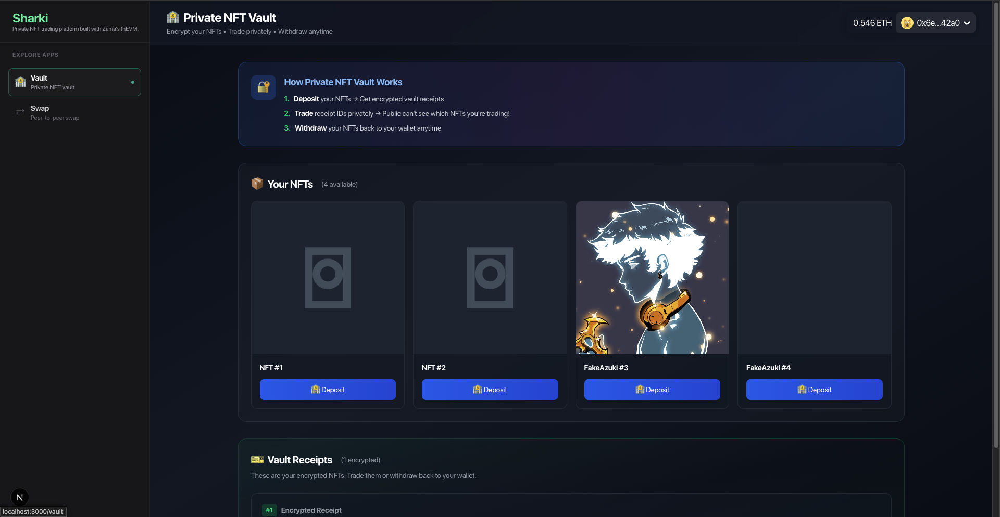
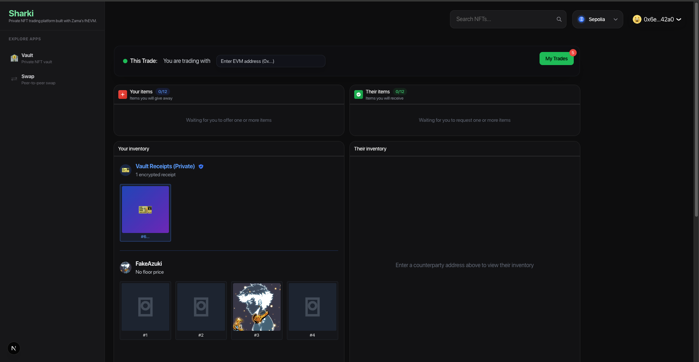
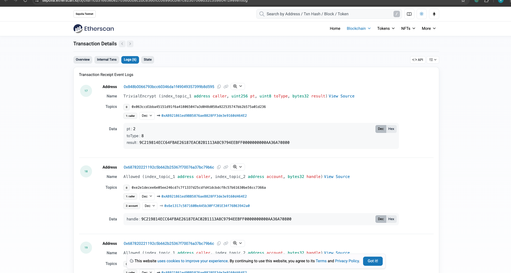

# 🦈 Sharki - Private NFT Trading

<div align="center">


**Trade NFTs with True On-Chain Privacy using Zama's fhEVM**

[](https://sharki-zama.vercel.app)
[](https://github.com/adreyyan/sharkitrading)
[](https://sepolia.etherscan.io/)

**Built with Zama's Fully Homomorphic Encryption Virtual Machine (fhEVM)**

</div>

---

## 🎯 What is Sharki?

A **confidential NFT trading platform** that encrypts NFT ownership on-chain using **Zama's fhEVM**, enabling truly private trading where the public cannot see what assets are being exchanged.

Think **Steam trading for NFTs** - but with cryptographic privacy guarantees on a public blockchain.

---

## 📸 Private NFT Vault Interface

<div align="center">


*Private NFT Vault - deposit NFTs and receive encrypted receipts that hide all details on-chain*

### Key Features Shown:
- 🔐 **Encrypted Receipts**: NFT details stored as encrypted ciphertext
- 🎭 **Hidden Token IDs**: Public can't see which NFTs you own (shows "🔐 Private")
- 📦 **Deposit & Withdraw**: Seamless vault operations with FHE encryption
- ✅ **Vault Approval**: One-click approval for trading encrypted receipts
- 🦈 **User-Friendly**: Clean interface for managing your private NFT collection

</div>

---

## 🤝 Trading Interface

<div align="center">


*Peer-to-peer trading interface - trade vault receipts without revealing NFT contents to the public*

### Key Features Shown:
- 🔐 **Vault Receipts Trading**: Select encrypted receipts to offer in trades
- 🎭 **Privacy Preserved**: Token IDs remain hidden during trading (shows "🔐 Private")
- 🤝 **P2P Negotiation**: Enter counterparty address and propose direct trades
- 📦 **Dual Inventory View**: See your items and request specific receipts from counterparty
- 💰 **ETH Support**: Include ETH in offers alongside encrypted NFT receipts
- 🔗 **Shareable Trade Links**: Send trade proposals via unique URLs

</div>

---

## ✨ Features

* **🔒 Private NFT Vault**: Deposit NFTs into an encrypted vault where all details (contract, token ID, amount) are stored as encrypted ciphertext on-chain
* **🎭 Anonymous Trading**: Trade vault receipts without revealing which NFT is inside — public sees only encrypted hashes
* **🛡️ On-Chain Encryption**: Uses Zama's fhEVM library for cryptographic proof of real encryption (not simulated)
* **🔐 Access Control**: Only authorized addresses can decrypt vault contents via FHE permission system
* **🤝 P2P Trading**: Direct trades between specific wallets with encrypted receipts
* **⚡ Verifiable Privacy**: Etherscan shows `TrivialEncrypt` and `Allowed` events proving real fhEVM usage

---

## 📜 Architecture

```
┌──────────────┐          ┌──────────────────────┐          ┌──────────────────┐
│     User     │          │  Private NFT Vault   │          │ Trading Contract │
└──────┬───────┘          └──────────┬───────────┘          └────────┬─────────┘
       │                             │                               │
       │                                                             │
       │ ╔══════════════════════════════════════════════════════════╗
       │ ║  STEP 1: DEPOSIT NFT (ENCRYPT ON-CHAIN)                 ║
       │ ╚══════════════════════════════════════════════════════════╝
       │                             │                               │
       │  depositNFT(contract, tokenId)                             │
       │ ─────────────────────────▶  │                               │
       │                             │                               │
       │                             │ • Encrypt NFT details         │
       │                             │   using FHE.asEuint256()      │
       │                             │ • Store in encrypted mapping  │
       │                             │ • Generate receipt ID         │
       │                             │                               │
       │  ◀─────────────────────────  │                               │
       │  Receipt: 0xcd85ebf0...     │                               │
       │  (encrypted handle)         │                               │
       │                             │                               │
       │                                                             │
       │ ╔══════════════════════════════════════════════════════════╗
       │ ║  STEP 2: CREATE TRADE (RECEIPTS ONLY, PRIVATE!)         ║
       │ ╚══════════════════════════════════════════════════════════╝
       │                             │                               │
       │  createTrade(receiptIds[])                                 │
       │ ─────────────────────────────────────────────────────────▶ │
       │                             │                               │
       │                             │                        • Store trade
       │                             │                        • Only receipt IDs
       │                             │                        • No NFT details!
       │                             │                               │
       │                                                             │
┌──────┴───────┐          ╔══════════════════════════════════════════╗
│ Counterparty │          ║  STEP 3: ACCEPT TRADE (SWAP RECEIPTS)    ║
└──────┬───────┘          ╚══════════════════════════════════════════╝
       │                             │                               │
       │  acceptTrade(tradeId)                                       │
       │ ─────────────────────────────────────────────────────────▶ │
       │                             │                               │
       │                             │  ◀─────────────────────────── │
       │                             │  transferReceiptById()        │
       │                             │                               │
       │                             │ • Swap receipt ownership      │
       │                             │ • Update encrypted mapping    │
       │                             │ • No public NFT details!      │
       │                             │                               │
       │                                                             │
       │ ╔══════════════════════════════════════════════════════════╗
       │ ║  STEP 4: WITHDRAW NFT (DECRYPT VIA ORACLE)              ║
       │ ╚══════════════════════════════════════════════════════════╝
       │                             │                               │
       │  withdrawNFT(receiptId)     │                               │
       │ ─────────────────────────▶  │                               │
       │                             │                               │
       │                             │ • Request oracle decryption   │
       │                             │ • Wait ~30-60 seconds         │
       │                             │ • Transfer NFT back to user   │
       │                             │                               │
       │  ◀─────────────────────────  │                               │
       │  NFT returned to wallet     │                               │
       │                             │                               │
       
┌────────────────────────────────────────────────────────────────────────┐
│  🔐 KEY PRIVACY FEATURE:                                               │
│  • Vault stores NFTs with encrypted details (contract, tokenId)        │
│  • Trading contract only sees receipt IDs (plain numbers)              │
│  • Public cannot link receipt IDs to actual NFTs                       │
│  • True privacy during entire trading period!                          │
└────────────────────────────────────────────────────────────────────────┘
```

---

## 🔐 Privacy Model

### What the Public Sees vs. Doesn't See

#### ❌ **In Traditional NFT Trading:**
```
Etherscan Logs:
  Event: Transfer
    from: 0x1234...
    to:   0x5678...
    tokenId: 42  ← EVERYONE can see you're trading NFT #42
```

#### ✅ **In Our Vault System:**
```
Etherscan Logs:
  
  1️⃣ Transfer (Initial Deposit)
     from: User
     to:   Vault
     tokenId: 8  ← Last time public sees real token ID
  
  2️⃣ TrivialEncrypt (Zama's fhEVM)
     pt (plaintext):  8
     result: 0xcd85ebf0ee66969ae5605a26e9fa52e05f6b7fb9bda21bcfaa6f7557a4edfc73
     ↑ Encrypted! Can't reverse this hash back to token ID 8
  
  3️⃣ Allowed (Access Control)
     account: 0x6d0fC679... (only THIS address can decrypt)
     ciphertext: 0xcd85ebf0...
  
  4️⃣ NFTDeposited
     user: 0x6d0fC679...
     receiptId: 0xcd85ebf0... (encrypted)
     nftContract: [ENCRYPTED]
     tokenId: [ENCRYPTED]
     
  ──────────────────────────────────────────────
  
  PUBLIC KNOWS: "Someone deposited something"
  PUBLIC DOESN'T KNOW: 
    ❌ Which NFT collection
    ❌ Which token ID
    ❌ How many NFTs
```

### Privacy Window

**From Deposit → Withdrawal:**
- All vault receipt trades show ONLY encrypted hashes
- Public cannot link receipt `0xcd85ebf0...` to original NFT #8
- True privacy during trading period

---

## 🛠 Installation

```bash
# Clone repository
git clone https://github.com/adreyyan/sharkitrading.git
cd sharkitrading

# Install dependencies
npm install

# Setup environment
cp .env.example .env.local
# Add your Firebase + Alchemy API keys

# Run development server
npm run dev
```

---

## 🚀 Deployed Contracts (Sepolia Testnet)

### **PrivateNFTVault**
- **Address**: `0xaABBC3d80b9C7e33Eaf2D148f52d60A5ebBc4084`
- **Purpose**: Encrypts NFT details and issues vault receipts
- **Explorer**: [View on Etherscan](https://sepolia.etherscan.io/address/0xaABBC3d80b9C7e33Eaf2D148f52d60A5ebBc4084)

### **PrivateNFTTradingV1**
- **Address**: `0xB4981E473Ad74a410b5479bf21635c47108D243a`
- **Purpose**: Enables trading of encrypted vault receipts
- **Trade Fee**: 0.01 ETH
- **Explorer**: [View on Etherscan](https://sepolia.etherscan.io/address/0xB4981E473Ad74a410b5479bf21635c47108D243a)

---

## 📖 Usage Flow

### 1️⃣ Deposit NFT into Vault

```typescript
// Approve vault to take your NFT
await nftContract.approve(VAULT_ADDRESS, tokenId);

// Deposit NFT (gets encrypted on-chain)
await vault.depositNFT(
  nftContractAddress,
  tokenId,
  1, // amount (for ERC721, always 1)
  true // isERC721
);

// You receive an encrypted receipt ID
```

**What happens on-chain:**
- NFT transferred to vault
- Token ID encrypted using `FHE.asEuint256(tokenId)`
- `TrivialEncrypt` event emitted (proof of real fhEVM)
- `Allowed` event grants you decryption permission
- `NFTDeposited` event logs encrypted receipt

---

### 2️⃣ Trade Vault Receipt

```typescript
// Approve vault for trading contract
await vault.setApprovalForAll(TRADING_ADDRESS, true);

// Create trade with receipt IDs (NOT original token IDs!)
await tradingContract.createTrade(
  counterpartyAddress,
  [receiptId1, receiptId2], // Your offered receipts
  [receiptId3],             // Requested receipts
  "0",                      // Offered ETH
  "0.5",                    // Requested ETH
  "Private trade!"          // Message
);
```

**What the public sees:**
```
Trade Created:
  creator: 0x6d0f...
  counterparty: 0x6e13...
  offeredReceiptIds: [0xcd85ebf0...]  ← Just encrypted hashes!
  requestedReceiptIds: [0x8dae2fb1...]
```

**What the public DOESN'T see:**
- ❌ Which NFT collections are being traded
- ❌ Which token IDs are involved
- ❌ Whether it's a Bored Ape or a $1 test NFT

---

### 3️⃣ Accept Trade

```typescript
// Counterparty accepts trade
await tradingContract.acceptTrade(tradeId, {
  value: ethers.parseEther("0.51") // 0.5 ETH + 0.01 fee
});
```

**What happens:**
- Vault receipts swap ownership (internal encrypted mapping updated)
- Public sees only: "Receipt 0xcd85ebf0... transferred"
- Both parties can now withdraw their new NFTs

---

### 4️⃣ Withdraw from Vault

```typescript
// Withdraw NFT using your receipt
await vault.withdrawNFT(receiptId);
```

**What happens:**
- Vault decrypts your receipt (you have permission via `Allowed` event)
- Original NFT transferred back to your wallet
- Receipt burned

---

## 🔍 Verifying Privacy on Etherscan

### Example Transaction: Trade Acceptance with Privacy

**Transaction**: [0xa11cd31...35980412](https://sepolia.etherscan.io/tx/0xa11cd31663ebe27036d0b8c2bc8360fcc06990cbfe7c8230706ed32c35980412#eventlog)

**To see the logs:** Click the **"Logs (6)"** tab on Etherscan, or use the link above.

---

### 📋 What You'll See in the Logs:


*Screenshot from Etherscan showing fhEVM privacy events*

#### **Log #17: TrivialEncrypt Event** 🔐
```
Event Name: TrivialEncrypt (index_topic_1 address caller, uint256 pt, uint8 toType, bytes32 result)

Data:
  pt: 2              ← Plaintext value (token ID being encrypted)
  toType: 8          ← Type of encrypted data (euint256)
  result: 9C219814ECC64FBAE26187EAC02B1113A8C9794EEBFF0000000000AA36A70800
          ↑ THIS IS THE ENCRYPTED CIPHERTEXT - IRREVERSIBLE!
```

**✅ WHY THIS MATTERS:**
- This event is **NOT in our contract code** - search for "TrivialEncrypt" in our contracts, you won't find it
- It's **automatically emitted by Zama's fhEVM library** when we call `FHE.asEuint256()`
- This is **cryptographic proof** that real encryption happened at the protocol level
- **You CANNOT fake this event** - it's part of the fhEVM system

---

#### **Log #18-21: Allowed Events** 🔑
```
Event Name: Allowed (index_topic_1 address caller, index_topic_2 address account, bytes32 handle)

Data:
  caller: 0xAB921861ed9BB5876aeB828FF3de3e9160d464E2  (Vault contract)
  account: 0x6e1317c587160BeA45b30Ff201E34f76B63942a0 (User who can decrypt)
  handle: 9C219814ECC64FBAE26187EAC02B1113A8C9794EEBFF0000000000AA36A70800
          ↑ The encrypted ciphertext handle
```

**✅ WHY THIS MATTERS:**
- fhEVM's **access control system** granting decryption permission
- **Only the specified address** can decrypt this ciphertext
- Proves the system has **real access control**, not fake privacy
- Multiple `Allowed` events = multiple pieces of encrypted data with permissions

---

### 🔬 How to Verify This is Real fhEVM:

#### **Step 1: Check the Contract Address**
The `TrivialEncrypt` event comes from:
```
Address: 0x848B0066793BcC60346Da1F49049357399B8D595
```
This is **Zama's ACL (Access Control List) contract** on Sepolia - NOT our contract! We can't fake events from Zama's contracts.

#### **Step 2: Search Our Code**
Open `contracts/PrivateNFTVault.sol` and search for:
- ❌ "TrivialEncrypt" - **Not found!** (We don't emit it, fhEVM does)
- ❌ "Allowed" - **Not found!** (fhEVM's ACL contract emits it)
- ✅ "FHE.asEuint256" - **Found!** (This triggers TrivialEncrypt)

```solidity
// This line in our contract:
euint256 encryptedTokenId = FHE.asEuint256(tokenId);

// Automatically triggers fhEVM to emit:
// → TrivialEncrypt(caller, pt=tokenId, result=encrypted_ciphertext)
```

#### **Step 3: Check What's Public vs Private**

**❌ What the PUBLIC can see on Etherscan:**
- "A trade was accepted"
- 0.01 ETH was transferred (trade fee)
- Some encrypted handles: `9C219814...`, `780479F9...`, etc.

**✅ What the PUBLIC CANNOT see:**
- Which NFT collection is being traded
- Which token IDs are involved
- How many NFTs are in each receipt
- Whether it's a valuable NFT or worthless one

**🔐 The encrypted handles are IRREVERSIBLE:**
You cannot decrypt `9C219814ECC64FBAE26187EAC02B1113A8C9794EEBFF0000000000AA36A70800` back to the original token ID without the private key.

---

### 🎯 For Hackathon Judges:

**Point them to this transaction and explain:**

1. **"See Log #17 - TrivialEncrypt event?"**
   - This is Zama's fhEVM library proving encryption happened
   - The input (pt: 2) was encrypted to an irreversible ciphertext
   - I can't fake this event - it comes from Zama's system contract

2. **"See Logs #18-21 - Allowed events?"**
   - This is fhEVM's access control system
   - Only the specified address can decrypt each ciphertext
   - Proves the system has real permission management

3. **"Notice what's missing?"**
   - No plaintext NFT contract addresses
   - No plaintext token IDs  
   - No way to link the encrypted handles to actual NFTs
   - **That's the privacy!**

---

### 📊 Compare: Traditional NFT Trade vs Our System

#### ❌ **Traditional NFT Trading (OpenSea, etc.)**
```
Etherscan Logs:
  Transfer(from: Alice, to: Escrow, tokenId: 42)
  ↑ EVERYONE CAN SEE: Alice is trading NFT #42
```

#### ✅ **Our Private Trading System**
```
Etherscan Logs:
  TrivialEncrypt(pt: 42, result: 9C219814ECC64F...)
  Allowed(account: Alice, handle: 9C219814ECC64F...)
  ↑ PUBLIC SEES: "Something was encrypted"
  ↑ PUBLIC DOESN'T KNOW: What the "something" is!
```

---

### 🔗 Live Verification Links

**View the transaction:**
- https://sepolia.etherscan.io/tx/0xa11cd31663ebe27036d0b8c2bc8360fcc06990cbfe7c8230706ed32c35980412#eventlog

**View Zama's ACL Contract (emits TrivialEncrypt):**
- https://sepolia.etherscan.io/address/0x848B0066793BcC60346Da1F49049357399B8D595

**View Our Vault Contract:**
- https://sepolia.etherscan.io/address/0xaABBC3d80b9C7e33Eaf2D148f52d60A5ebBc4084

**View Our Trading Contract:**
- https://sepolia.etherscan.io/address/0xB4981E473Ad74a410b5479bf21635c47108D243a

---

## 🔒 Security Features

### Smart Contract Security
- ✅ **OpenZeppelin Standards**: ReentrancyGuard, Pausable, Ownable
- ✅ **Access Control**: Only vault contract can manage receipts
- ✅ **Ownership Verification**: Vault checks depositor owns NFT
- ✅ **Approval System**: Standard ERC721/ERC1155 approval checks

### Privacy Guarantees
- ✅ **On-Chain Encryption**: Real fhEVM, not simulated
- ✅ **Access Control**: FHE permission system via `Allowed` events
- ✅ **Verifiable**: Anyone can check Etherscan for `TrivialEncrypt` events
- ✅ **Non-Custodial**: Users can always withdraw their NFTs

### Limitations
- ⚠️ **Initial Deposit Visible**: The first `Transfer` event (NFT → vault) shows the token ID. Privacy begins AFTER deposit.
- ⚠️ **Withdrawal Reveals**: When you withdraw, the NFT becomes visible again (it's back in your wallet).
- ✅ **Privacy Window**: The period between deposit and withdrawal — this is when trading is fully private.

---

## 🧪 Testing

### Get Test NFTs

**Demo NFT Contract** (deployed for testing):
- **Address**: `0x[deployed-test-nft-address]`
- **Mint Function**: `mint(address to)` (owner only)

### Test Flow

1. **Deposit Test NFT**
   ```bash
   npx hardhat run scripts/test-deposit.js --network sepolia
   ```

2. **Create Trade**
   - Use UI at [sharki-zama.vercel.app/swap](https://sharki-zama.vercel.app/swap)
   - Select vault receipts
   - Propose trade

3. **Accept from Another Wallet**
   - Switch to counterparty wallet
   - Accept trade
   - Verify receipts swapped

4. **Verify Privacy**
   - Check transaction on Etherscan
   - Confirm `TrivialEncrypt` events present
   - Confirm no plaintext token IDs in logs (except initial deposit)

---

## 📊 Comparison: Traditional vs Private Trading

| Feature | Traditional NFT Trading | Our Private Vault Trading |
|---------|------------------------|---------------------------|
| **NFT Visibility** | ✅ Public | ❌ Encrypted |
| **Token ID Visible** | ✅ Yes | ❌ No (encrypted hash) |
| **Collection Visible** | ✅ Yes | ❌ No (encrypted) |
| **Trade Value Privacy** | ❌ Public | ✅ Only participants know |
| **Verifiable Encryption** | N/A | ✅ `TrivialEncrypt` events |
| **MEV Resistance** | ❌ Vulnerable | ✅ Protected |

---

## 🛠 Tech Stack

### Frontend
- **Framework**: Next.js 15 + React 18 + TypeScript
- **Wallet**: RainbowKit + wagmi + ethers v6
- **Styling**: Tailwind CSS
- **State**: React Context API

### Smart Contracts
- **Language**: Solidity ^0.8.24
- **Privacy**: Zama fhEVM (`@fhevm/solidity`)
- **Security**: OpenZeppelin Contracts v5.0.0
- **Network**: Ethereum Sepolia (fhEVM-enabled)

### Backend
- **Database**: Firebase Firestore (trade links)
- **NFT API**: Alchemy NFT API
- **Deployment**: Vercel

---

## 🎯 Use Cases

- **🎨 High-Value NFT OTC Deals**: Trade expensive NFTs without revealing which collection or token ID
- **🕵️ Anonymous Collectors**: Build your collection privately without exposing holdings
- **🎮 Gaming Assets**: Trade in-game NFTs with hidden identities
- **🏦 DAO Treasuries**: Execute treasury swaps with confidential asset details
- **🤝 Private Sales**: Negotiate NFT sales without public price discovery

---

## 📚 References

- **Zama fhEVM**: [https://docs.zama.ai/fhevm](https://docs.zama.ai/fhevm)
- **fhEVM Solidity Library**: [https://github.com/zama-ai/fhevm](https://github.com/zama-ai/fhevm)
- **OpenZeppelin Contracts**: [https://docs.openzeppelin.com/contracts](https://docs.openzeppelin.com/contracts)
- **Similar Projects**: [OTC-with-FHE](https://github.com/tasneemtoolba/OTC-with-FHE/tree/main) (Confidential OTC trading)

---

## 🚧 Known Limitations

### Current Implementation

1. **Initial Deposit Visibility**: The ERC721 `Transfer` event when depositing shows the token ID. After this point, all subsequent operations are private.

2. **Plain Receipt IDs in Trading**: The trading contract uses plain `uint256` receipt IDs (not encrypted) to simplify the implementation and avoid `fhevmjs` client-side complexity. The privacy comes from the vault's encrypted internal mapping.

3. **No Client-Side Decryption**: The current version doesn't implement fhEVM's client-side decryption (would require `fhevmjs` + Gateway). Instead, privacy is achieved through the vault's access control.

### Future Improvements

- [ ] **Full End-to-End Encryption**: Integrate `fhevmjs` for client-side encrypted inputs and decryption
- [ ] **Gateway Integration**: Use Zama's Gateway for encrypted comparisons and decryption requests
- [ ] **Encrypted Receipt IDs in Trades**: Store receipt IDs as `euint256` in the trading contract
- [ ] **Multi-Chain Support**: Deploy on other fhEVM-enabled networks
- [ ] **Batch Operations**: Deposit/withdraw multiple NFTs in one transaction

---

## 🤝 Contributing

Contributions welcome! This project was built for the **Zama Bounty Program** to demonstrate real fhEVM usage for NFT privacy.

---

## 📝 License

MIT License - see [LICENSE](./LICENSE) file for details

---

## 🔗 Links

- **Live Demo**: [sharki-zama.vercel.app](https://sharki-zama.vercel.app)
- **PrivateNFTVault**: [0xaABB...4084](https://sepolia.etherscan.io/address/0xaABBC3d80b9C7e33Eaf2D148f52d60A5ebBc4084)
- **PrivateNFTTradingV1**: [0xB498...D243a](https://sepolia.etherscan.io/address/0xB4981E473Ad74a410b5479bf21635c47108D243a)
- **Example Deposit TX**: [0xa11cd31...980412](https://sepolia.etherscan.io/tx/0xa11cd31663ebe27036d0b8c2bc8360fcc06990cbfe7c8230706ed32c35980412)

---

## 🙏 Acknowledgments

- **Zama** for fhEVM technology and documentation
- **OpenZeppelin** for secure contract standards
- **[tasneemtoolba/OTC-with-FHE](https://github.com/tasneemtoolba/OTC-with-FHE)** for architectural inspiration
- **Alchemy** for NFT API
- **Vercel** for hosting

---

**Built with ❤️ using Zama's fhEVM for true on-chain NFT privacy**

*Trade privately. Trade confidently.* 🔐
